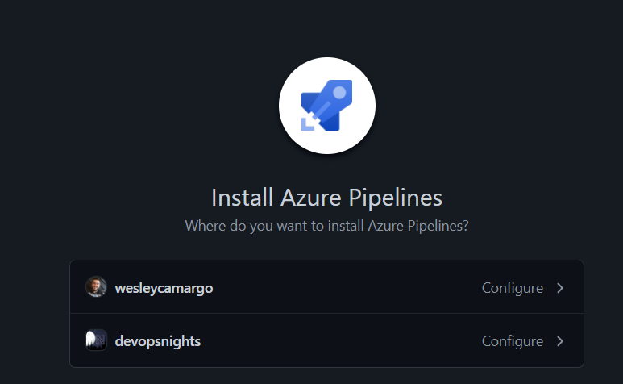
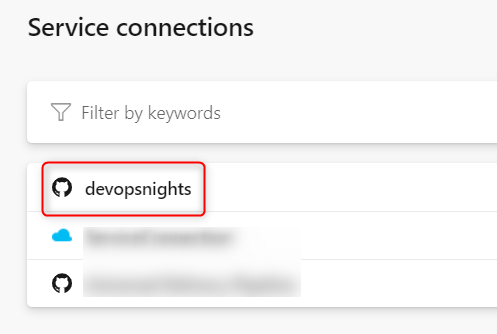

In the second live for create the UDP - Universal Delivery Pipeline, we showed how to create a Service Connection for your GitHub Organization in Azure DevOps. In this post I'll walk trough those steps.

<iframe width="968" height="545" src="https://www.youtube.com/embed/kJ1JoZrrwMU&t=725s" frameborder="0" allow="accelerometer; autoplay; clipboard-write; encrypted-media; gyroscope; picture-in-picture" allowfullscreen></iframe>

## The intuitive way doesn't work =/

There is no explicit way to do this. Although GitHub is an option in Service Connections, it only links your personal account to Azure DevOps, if you need to link your GitHub Organization it won't work.

*There is an option to create a GitHub Service connection, but...*

*Where is my org repo?*

## Linking the GitHub Organization

To link your organization is under of all your personal repositories. So you need to go all the way to the to bottom, and them select an specific connection:

And then it open a screen with the option to install the GitHub App:

It will redirect you to a GitHub page to choose your organization:

Now you need to give some credentials and after this you will have a service connection ready for use!

If you want more details, you can follow the video on the top of the post.

I hope it can be helpful and see you on the next post!

---

The UDP - Universal Delivery Pipeline is a set of YAML Pipelines templates that has the purpose to create build and deployment templates to deploy every kind of technology (dotnet, node, terraform, Java, etc), everywhere (public and private clouds such as Azure, AWS, GCP, VMWare, bare metal, etc).

We are creating this project in lives on the [DevOps Nights channel](https://youtu.be/hIkwU3CnJzU) and you can follow the progress every Thursday at 10 PM (CET) =).

You can see the code and contribute on our GitHub [tag](https://github.com/devopsnights/UDP-Application). 

